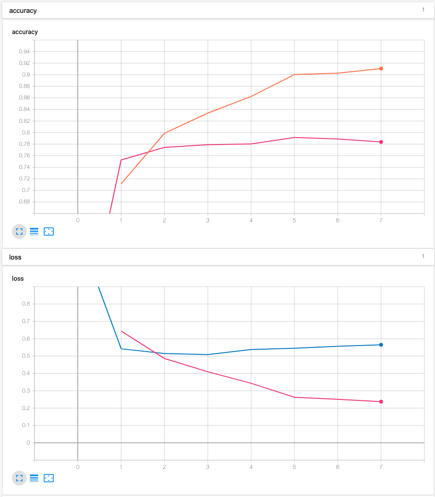

We apply a model that uses BERT as a backbone to two similar problems:

- [Google QUEST Q&A Labeling](https://www.kaggle.com/c/google-quest-challenge): assign 30 scores (from 0 to 1) 
to a question-answer pair.
- [Tweet sentiment analysis](https://www.kaggle.com/c/tweet-sentiment-extraction): assign a sentiment
to a tweet (positive, negative or neutral). This task differs from the original task of the 
competition. 

## Theory

- [Attention is all you need](https://arxiv.org/pdf/1706.03762.pdf)
- [Attention is all you need (step by step explanation)](https://nlp.seas.harvard.edu/2018/04/03/attention.html)
- [BERT](https://arxiv.org/pdf/1810.04805.pdf)

## Quick start

- Download the data from [here](https://www.kaggle.com/c/google-quest-challenge/overview), modify the 
  variables `DATA_DIR`, `RESULTS_DIR` from .env and load it:  
    ```bash
    source .env
    ```
    create a python virtual environment and install the dependencies:
    ```bash 
    conda create -n nlu python=3.6 -y
    conda activate nlu 
    pip install -r requirements.txt
    python setup.py install
    ```

<details>
    <summary>Tweet sentiment analysis</summary>

- Train the model (remove `size_tr_val` to use the complete dataset; `size_val` refers to the size of the validation
 dataset): 
    ```bash 
    python exec/train_tweet_sentiment.py \
        --data_path "${DATA_DIR}/train.csv" \
        --model_dir "${RESULTS_DIR}/models" \
        --log_dir "${RESULTS_DIR}/logs" \
        --size_val 2700 \
        --batch_size 50 \
        --num_epochs 10 \
        --print_freq 200 \
        --seed 10
    ```
- Results from the training can be visualised with tensorboard:
    ```
    tensorboard --logdir=${RESULTS_DIR}/logs
    ```
    or within a Jupyter notebook
    ```
    %reload_ext tensorboard
    %tensorboard --logdir <logs directory>
    ```
    The logs from this training session are available in the `logs` 
    directory (`tensorboard --logdir=logs`).
    <br> 
    


</details>


<details>
    <summary>Google QUEST Q&A Labeling (WIP)</summary>

TODO: The metric logger has to be improved in order to know how good the model performs. 
At the moment we just record the binary cross entropy for every one of the 30 scores 
that have to be assigned to a question-answer pair. 
- Train the model (remove `size_tr_val` to use the complete dataset; `size_val` refers to the size of the validation
 dataset): 
    ```bash 
    python exec/train_google_qa.py \
        --data_path ${DATA_DIR}/train.csv \
        --model_dir ${RESULTS_DIR}/models \
        --log_dir ${RESULTS_DIR}/logs \            
        --size_tr_val 100\
        --size_val 40\
        --batch_size 6 \
        --num_epochs 2 \
        --print_freq 10 \
        --seed 10
    ```

- Make a prediction (only for the first 100 elements from the test set):
    ```bash 
    python exec/predict_google_qa.py \
        --data_path ${DATA_DIR}/test.csv \
        --result_dir ${RESULTS_DIR}/results \
        --model_dir ${RESULTS_DIR}/models \
        --load_epoch 1 \
        --batch_size 2 \
        --n_el 100
    ```
</details>